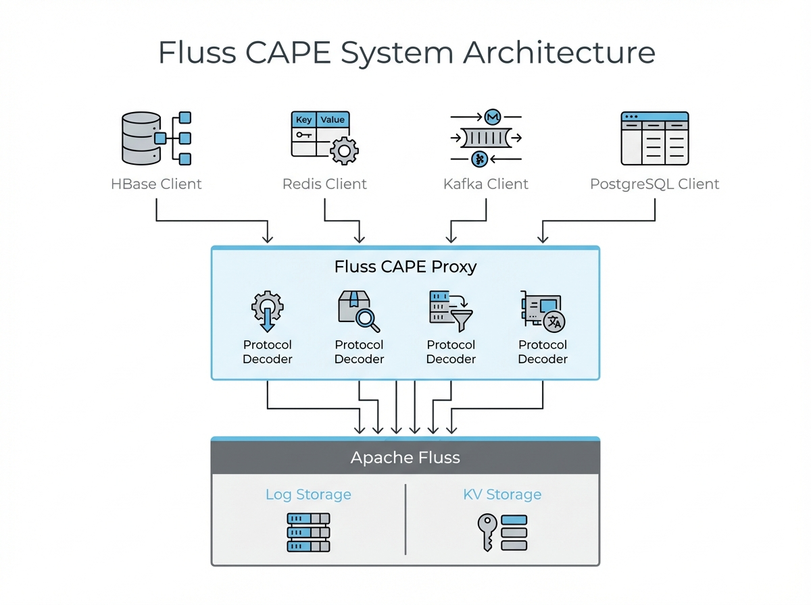
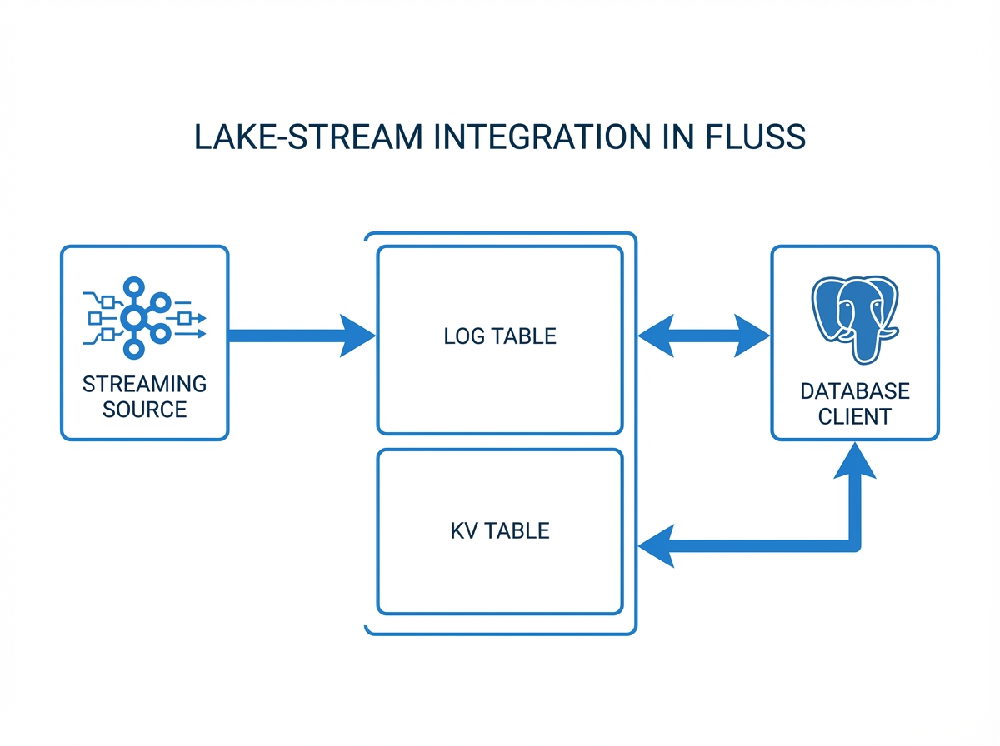

# Fluss CAPE - Architecture Design

## Overview

Fluss CAPE provides HBase, Redis, Kafka, and PostgreSQL protocol compatibility for Apache Fluss, enabling applications to interact with Fluss using familiar APIs without code changes.

**Key Design Principles:**
- **Protocol Translation**: Standalone layer that translates standard protocols to Fluss operations
- **Zero Fluss Modifications**: CAPE runs as an external service, no changes to Fluss core
- **Dynamic Table Management**: Create tables on-demand via protocol-specific commands
- **Horizontal Scalability**: Stateless proxy design supports scaling out CAPE instances

## High-Level Architecture



```
┌─────────────────────────────────────────────────────────────────────────────┐
│                            Client Applications                              │
├──────────────┬──────────────────────────────┬───────────────┬───────────────┤
│  HBase API   │      Redis Clients           │ Kafka Clients │ SQL/PG Clients│
│  (Java/Spark)│  (redis-cli/Python/Node.js)  │ (Consumer/Prod) (psql/DBeaver) │
└──────┬───────┴──────────────┬───────────────┴───────┬───────┴───────┬───────┘
       │                      │                       │               │
       │ ZK Discovery         │ HAProxy LB            │ Direct/LB     │ Direct/LB
       ▼                      ▼                       ▼               ▼
┌─────────────────────────────────────────────────────────────────────────────┐
│                       Fluss CAPE Servers (Stateless Proxy)                  │
│  ┌─────────────────┬───────────────────┬──────────────────┬───────────────┐ │
│  │ HBase Protocol  │  Redis Protocol   │  Kafka Protocol  │  PG Protocol  │ │
│  │   Decoder       │   RESP Decoder    │     Decoder      │    Decoder    │ │
│  ├─────────────────┼───────────────────┼──────────────────┼───────────────┤ │
│  │ HBase Executors │ Redis Executors   │ Kafka Handlers   │ PG Executors  │ │
│  │  - Get/Put      │  - String/Hash/Set│  - Produce       │  - SQL Query  │ │
│  │  - Scan         │  - List/ZSet      │  - Fetch         │  - DML/DDL    │ │
│  │  - Admin        │  - Stream/Geo/HLL │  - Metadata      │  - Catalog    │ │
│  └────────┬────────┴──────────┬────────┴──────────┬───────┴───────┬───────┘ │
│           │                   │                   │               │         │
│           └──────┬────────────┴─────────┬─────────┴───────────────┘         │
│                  ▼                      ▼                                   │
│         Fluss KV Table API      Fluss Log Table API                         │
└──────────────────┬──────────────────────┬───────────────────────────────────┘
                   │                      │
                   ▼                      ▼
        ┌─────────────────────────────────────────────────────┐
        │                 Apache Fluss Cluster                │
        │  (Distributed Streaming & Relational Storage)       │
        │   - Coordinator (Metadata & Balancing)              │
        │   - Tablet Servers (Data Storage & Execution)       │
        └─────────────────────────────────────────────────────┘
```

## CAPE as HBase RegionServer

**Critical Architectural Concept**: CAPE servers act as **HBase RegionServers**, NOT as HBase Masters.

### Why RegionServer Role?

| Aspect | HBase Master | HBase RegionServer | CAPE Role |
|--------|--------------|-------------------|-----------|
| **Purpose** | Cluster coordination, metadata management | Data serving, client operations | ✅ Data serving |
| **Client Operations** | Admin operations only | Get/Put/Scan/Delete | ✅ Full data operations |
| **Default RPC Port** | 16000 | **16020** | ✅ **16020** |
| **Web UI Port** | 16010 | 16030 | N/A (optional) |
| **ZK Registration** | `/hbase/master` | `/hbase/rs/{server-id}` | ✅ `/hbase/rs/cape-server-*` |
| **Discovery** | Single master endpoint | Multiple servers via ZK | ✅ Multiple CAPE instances |

### Service Discovery

**HBase clients discover CAPE instances through ZooKeeper**:

1. CAPE servers register to ZooKeeper as RegionServers:
   ```
   /hbase/rs/cape-server-1 → "localhost,16020,timestamp"
   /hbase/rs/cape-server-2 → "localhost,16021,timestamp"
   ```

2. HBase clients query ZooKeeper to find all available RegionServers:
   ```java
   config.set("hbase.zookeeper.quorum", "localhost:2181");
   // Client automatically discovers all CAPE instances
   ```

3. Client-side load balancing handles requests across CAPE instances

## Component Details

### 1. Protocol Decoders

**HBase RPC Decoder**:
- Decodes HBase RPC protocol (Protobuf-based)
- Handles CellBlock format for bulk data transfer
- Supports SASL/GSSAPI authentication

**Redis RESP Decoder**:
- Uses Netty's built-in RESP codec
- Handles pipelined commands
- Supports RESP2 protocol

**Kafka Wire Decoder**:
- Implements Kafka Wire Protocol (Request/Response)
- Decodes RecordBatches for efficient message handling
- Supports API versions compatible with Kafka 3.x clients

**PostgreSQL Decoder**:
- Implements PG Frontend/Backend protocol
- Handles startup messages, simple/extended queries
- Supports SSL negotiation and standard authentication

### 2. Command Executors

**HBase Executors**:
- Single-row operations (Get, Put)
- Range scan operations (Translated to Fluss Lookups/Scans)
- Batch operations
- Admin operations for table management

**Redis Executors**:
- String operations (GET, SET, INCR, etc.)
- Hash operations (HSET, HGET, HGETALL, etc.)
- Set operations (SADD, SMEMBERS, etc.)
- List operations (LPUSH, RPOP, LRANGE, etc.)
- Sorted Set operations (ZADD, ZRANGE, ZSCORE, etc.)
- Stream operations (XADD, XRANGE, XREAD, etc.)

**Kafka Handlers**:
- **Produce**: Append-only writes to Fluss Log tables
- **Fetch**: Sequential reads from Log segments
- **Metadata**: Real-time mapping of Fluss table/partition info to Kafka topics

**PostgreSQL Executors**:
- **Calcite-based SQL Engine**: Parses and optimizes SQL queries
- **Hybrid Scan**: Combines KV snapshots and Log changelogs for consistent reads
- **Catalog Service**: Maps Fluss metadata to PG `information_schema`

### 3. Storage Adapters

**Unified Multi-Model Storage**:
CAPE leverages Fluss's dual-engine capability:
- **KV Adapter**: Maps Key-Value protocols (HBase/Redis) to Primary Key tables.
- **Log Adapter**: Maps Messaging protocols (Kafka) to Log tables.
- **Changelog Bridge**: Mutations in KV tables are automatically exposed as Logs, allowing Kafka clients to consume HBase/Redis updates in real-time.

## Data Flow & Lake-Stream Integration



CAPE translates protocol-specific operations into Fluss table operations:

- **HBase/Redis operations** are converted to Fluss row operations on KV tables.
- **Kafka operations** flow directly into Fluss Log tables.
- **SQL queries** are executed via a hybrid engine that queries both KV and Log components to ensure data freshness.

## References

- [Apache Fluss Documentation](https://fluss.apache.org/)
- [HBase Protocol Specification](https://hbase.apache.org/book.html#rpc)
- [Redis Protocol Specification](https://redis.io/docs/reference/protocol-spec/)
- [Configuration Reference](docs/CONFIGURATION.md)
- [Getting Started Guide](docs/GETTING-STARTED.md)
